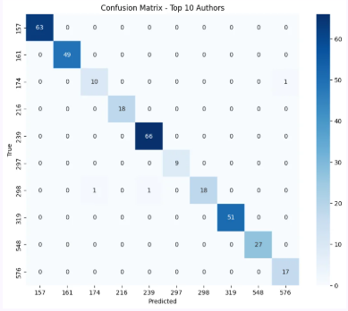
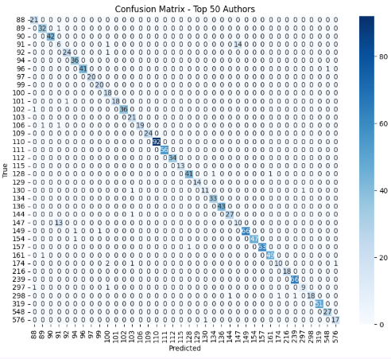
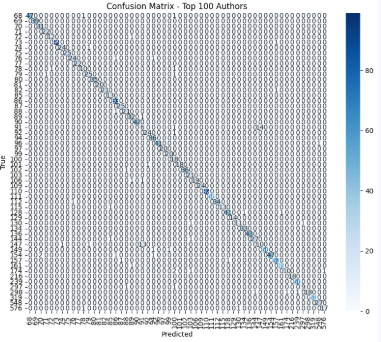
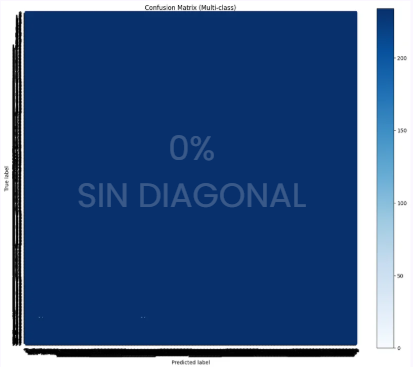

# CopyCode
Repositorio del proyecto para identificación de autoría en código C++

## Equipo
* Rommel Pacheco Hernández - A01709035
* Ian Julián Estrada Castro - A01352823
* Daniel Emilio Fuentes Portaluppi - A01708302

# Descripción del Proyecto
En este proyecto se creará un modelo de clasificación de código con la capacidad de identificar autoría de código fuente en el lenguaje de programación C++.

# Contexto
En el módulo se revisan redes neurolanes de capas densas y convolutivas cuyas funciones y parámetros le permitirán al modelo aprender a partir de código fuente.

# Descripción del dataset
El dataset utilizado es [AI-SOCO](https://github.com/AliOsm/AI-SOCO) disponible públicamente *GitHub* bajo la licencia **MIT**.

Espacio en disco: 8.63 MB

El dataset está dividido en train, development y testing con 50000, 25000 y 25000 ejemplos, respectivamente. Cada uno consiste de dos partes:
* Archivos CSV: Contiene pares de ids de usuarios (uids) y ids de problemas (pids). 
    * dev.csv: Cada uid aparece 25 veces en el archivo con 25 pids diferentes para entrenamiento.
    * unlabeled_test.csv: Cada uid aparece 25 veces en el archivo con 25 pids diferentes para entrenamiento.
    * train.csv: Cada uid aparece 50 veces en el archivo con 50 pids diferentes para entrenamiento.
* Directorios: Contienen los códigos fuentes. Cada pid en el archivo CSV está conectado al archivo de código fuente de su respectivo directorio directorio.
    * dev: Contiene 25000 ejemplos
    * test: Contiene 25000 ejemplos
    * train: Contiene 50000 ejemplos

Dada la estructura y contenido y el problema que ataca, el dataset está enfocado en la identificación de autoría de un código fuente en C++. No se utilizó el dataset de test puesto que el csv unlabeled_test tiene los uids vacíos, lo que no nos es útil para aprendizaje supervisado.

# Metodología

## Separación
El dataset ya se encuentra separado, por lo que este paso no es necesario. 

## Preprocesamiento
Se copió el código fuente de los tres datasets a un csv distinto para cada uno con el fin de evitar nuevas lecturas de archivos en caso de experimentos futuros. 
train_source
dev_dource
test_source

### Tokenización
Para la tokenización se siguió el enfoque de [1] [2], donde el propósito inicial fue transformar el código fuente (Python en su caso) en un formato vectorial que pueda ser procesado por un transformer entrenado desde cero u otro preentrenado como codeBERT.
Se utilizó el modelo preentrenado BERT para la tokenización, esto devolvió los identificadores de los tokens de los códigos en forma de una lista por cada uno.

### Encoding
Los uids se codificaron por medio de LabelEncoder de scikit learn. 

# Modelo
## Descripción del modelo
Para el problema de identificación de autoría de código fuente se empleo una arquitectura basada en [1] [3], sobre todo en la segunda, donde los autores aplicaron una red neuronal híbrida (HNN) que combina componentes convolucionales (Inception-v1) y recurrentes (BiGRU). El objetivo principal fue identificar rasgos informativos que el programador no controla conscientemente.
GRU (Gated Recurrent Unit) es un tipo de arquitectura de red neuronal recurrente diseñada para procesar secuencias de datos. Se utilizó la variante bidireccional que mejoraba el análisis al considerar el contexto anterior y el que sigue.

* InceptionBlock
  * Conv1D layer: Con 64 filtros, kernel size de 1, función de activación relu y pading same.
  * Conv1D layer: Con 128 filtros, kernel size de 3, función de activación relu y pading same.
  * Conv1D layer: Con 256 filtros, kernel size de 5, función de activación relu y pading same.
  * Concatenation
* Bidirectional layer: Con GRU y 128 filtros
* Dense layer: Con 512 nuronas y función de activación relu
* Dropout layer: Con una tasa de 20%
* Dense layer: Con 512 nuronas y función de activación relu
* Dropout layer: Con una tasa de 20%
* Dense layer: Con 1000 neuronas y función de activación softmax. Donde 1000 es el número de autores

Hiperparámetros
* optimizer: Adam
* learning_rate: 0.0001
* loss: sparce_categorical_crossentropy
* epochs: 54
* batch size: 16

## Resultados

Los resultados fueron medidos para el mejor modelo en toda la historia de las épocas, con 10, 50, 100 y 1000 autores. 

| Métrica   | Train | Dev (10 autores) | Dev (50 autores) | Dev (100 autores) | Dev (1000 autores) |
|---------- | ----- | ---------------- | ---------------- | ----------------- | ------------------ |
| Loss      | 0.27  | 4.27 | 4.27 | 4.27 | 4.27  | 
| Accuracy  | 0.92  | 0.99 | 0.95 | 0.95 | 0.008 |
| Precision |       | 0.97 | 0.95 | 0.95 | 0.000 |
| Recall    |       | 0.63 | 0.67 | 0.69 | 0.000 |
| F1-score  |       | 0.75 | 0.78 | 0.79 | 0.000 |

## Matrices de confusión

## Matrices de confusión

### 10 autores

### 50 autores

### 100 autores

### 1000 autores

## Conclusiones
Aunque el modelo mantiene un desempeño elevado para los conjuntos de 10, 50 y 100 autores, se observa una disminución significativa al trabajar con los mil autores del conjunto completo. De todos los ejemplos que realmente pertenecían a una clase, el modelo identificó correctamente el 67%. Cuando el modelo predice una clase, el 95% de esas predicciones suelen ser correctas. 

# Discusiones
Esta arquitectura fue pensada para una menor cantidad de autores y esto se refleja en nuestras matrices de confusión. La arquitectura propuesta mostró un desempeño adecuado para conjuntos reducidos de autores. Sin embargo, al escalar a 1000 autores, la capacidad discriminativa del modelo disminuyó considerablemente, aumenta el número de clasificaciones erróneas y la dispersión de las predicciones en distintas clases. Esto sugiere que la arquitectura no posee suficiente capacidad representacional para modelar las diferencias sutiles existentes entre un número tan elevado de autores.
El modelo que se empleó fue BERT-base-uncased, una arquitectura originalmente diseñada para lenguaje natural. Aunque este modelo es capaz de procesar secuencias de código fuente, no fue preentrenado sobre repositorios de software ni posee conocimiento específico sobre estructuras sintácticas y semánticas de programación. Esto probablemente limitó la calidad de las representaciones aprendidas y afectó negativamente el desempeño final.
Los programas fueron divididos en múltiples fragmentos (dada la limitación de longitud de entrada de BERT), esto pudo provocar pérdida de información contextual relevante para la identificación de autoría, ya que ciertos patrones de programación se manifiestan a nivel de archivo completo y no necesariamente fragmentos individuales.
Comparándolo con el estado del arte en identificación de autoría y detección de plagio [1] [2] [3], no pudimos alcanzarlo, puesto que, a pesar de tener un buen accuracy como el modelo comparado, otros modelos ya existentes tienen métricas más confiables, lo que dice que hay modelos que cuentan con una mejor capacidad de discriminación.

# Referencias

[1] D. Álvarez-Fidalgo, & F. Ortin, "CLAVE: A deep learning model for source code authorship verification with contrastive learning and transformer encoders," *Information Processing & Management*, vol. 62, art. no. 104005, 2025, doi: https://doi.org/10.1016/j.ipm.2025.104093

[2] P. T. Nguyen, J. Di Rocco, C. Di Sipio, R. Rubei, D. Di Ruscio y M. Di Penta, "GPTSniffer: A CodeBERT-based classifier to detect source code written by ChatGPT," *The Journal of Systems and Software*, vol. 214, art. no. 112059, 2024, doi: https://doi.org/10.1016/j.jss.2024.112059

[3] A. Kurtukova, A. Romanov & A. Shelupanov, "Source Code Authorship Identification Using Deep Neural Networks," *Symmetry*, vol. 12, no. 12, art. no. 2044, 2020, doi: https://doi.org/10.3390/sym12122044
